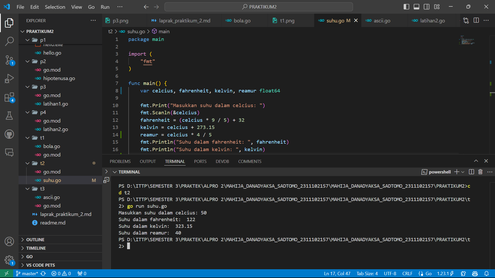

# <h1 align="center">Laporan Praktikum Modul 1 - Hello World</h1>
<p align="center">Mahija Danadyaksa Sadtomo_2311102157</p>

## A. Hello World

```go
package main

import (
	"fmt"
)

func main() {
	fmt.Println("Hello, World!")
	var greetings string = "Selamat datang di dunia go!"
	var a, b int

	fmt.Println(greetings)
	fmt.Scanln(&a, &b)
	fmt.Printf("%v + %v = %v\n", a, b, a+b)
}
```


## B. Hipotenusa

```go
package main

import (
	"fmt"
)

func main() {
	var a, b, c float64
	var hipotenusa bool

	fmt.Print("Masukkan nilai A: ")
	fmt.Scanln(&a)
	fmt.Print("Masukkan nilai B: ")
	fmt.Scanln(&b)
	fmt.Print("Masukkan nilai C: ")
	fmt.Scanln(&c)
	hipotenusa = (c * c) == (a*a + b*b)
	fmt.Println("Sisi c adalah hipotenusa segitiga a, b, c: ", hipotenusa)
}
```


## C. Latihan 1

```go
package main

import (
	"fmt"
)

func main() {
	var(
	satu, dua, tiga string
	temp string
	)
	fmt.Print("Masukkan input String: ")
	fmt.Scanln(&satu)
	fmt.Print("Masukkan input String: ")
	fmt.Scanln(&dua)
	fmt.Print("Masukkan input String: ")
	fmt.Scanln(&tiga)
	fmt.Println("Output awal: ", satu + " " + dua + " " + tiga)
	temp = satu
	satu = dua
	dua = tiga
	tiga = temp
	fmt.Println("Output akhir: ", satu + " " + dua + " " + tiga)
}
```


## D. Latihan 2

```go
package main

import (
	"fmt"
)

func main() {
	var tahun int

	fmt.Print("Masukkan tahun: ")
	fmt.Scanln(&tahun)

	if tahun%4 == 0 {
		if tahun%100 == 0 {
			if tahun%400 == 0 {
				fmt.Println("Tahun kabisat")
			} else {
				fmt.Println("Bukan tahun kabisat")
			}
		} else {
			fmt.Println("Tahun kabisat")
		}
	} else {
		fmt.Println("Bukan tahun kabisat")
	}
}
```


## E. Bola (Tugas no. 3)

```go
package main

import (
	"fmt"
)

func main() {
	var r float64
	var luas, volume float64

	fmt.Print("Masukkan jari-jari bola: ")
	fmt.Scanln(&r)
	luas = 4 * 3.14 * r * r
	volume = (4.0 / 3.0) * 3.14 * r * r * r
	fmt.Println("Bola dengan jejari ", r, " memiliki volume ", volume, " dan luas kulit ", luas)
}
```


## F. Suhu (Tugas no. 4)

```go
package main

import (
	"fmt"
)

func main() {
	var celcius, fahrenheit, kelvin, reamur float64

	fmt.Print("Masukkan suhu dalam celcius: ")
	fmt.Scanln(&celcius)
	fahrenheit = (celcius * 9 / 5) + 32
	kelvin = celcius + 273.15
	reamur = celcius * 4 / 5
	fmt.Println("Suhu dalam fahrenheit: ", fahrenheit)
	fmt.Println("Suhu dalam kelvin: ", kelvin)
	fmt.Println("Suhu dalam reamur: ", reamur)
}
```


## G. ASCII (Tugas no. 5)

```go
package main

import "fmt"

func main() {

	var a, b, c, d, e int
	fmt.Scan(&a, &b, &c, &d, &e)
	
	var kata string
	fmt.Scan(&kata)
	
	fmt.Printf("%c%c%c%c%c\n", a, b, c, d, e)
	
	if len(kata) == 3 {
		fmt.Printf("%c%c%c\n", kata[0]+1, kata[1]+1, kata[2]+1)
	} else {
		return
	}
}
```
