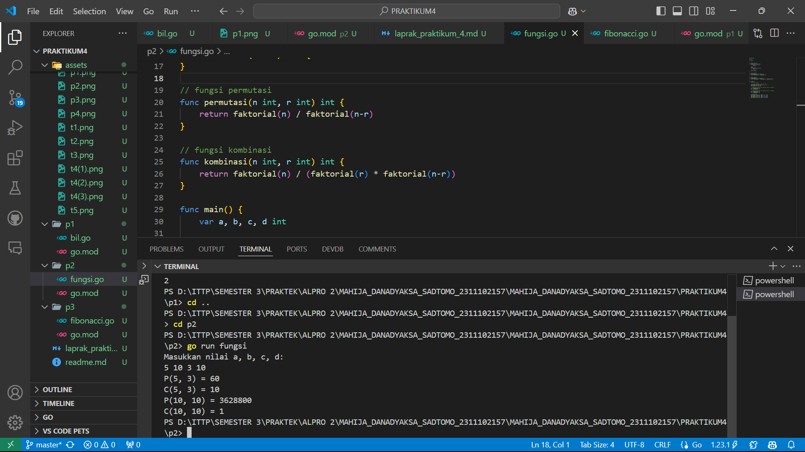
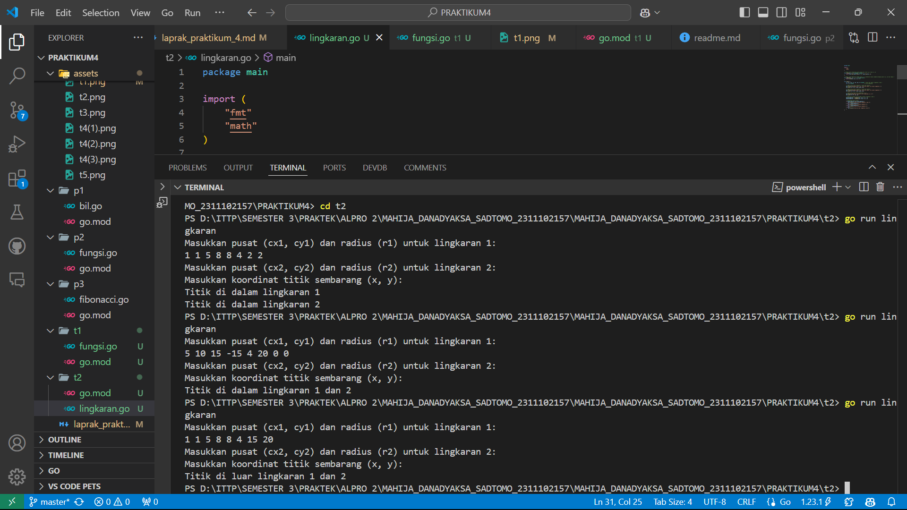

# <h1 align="center">Laporan Praktikum Modul 4</h1>
<p align="center">Mahija Danadyaksa Sadtomo_2311102157</p>

## A. Bilangan Faktorial dan Permutasi

```go
package main
import (
	"fmt"
)
func main () {
	var a, b int
	fmt.Scan(&a, &b)
	if a >= b {
		fmt.Println(permutasi(a, b))
	} else {
		fmt.Println(permutasi(b, a))
	}
}
func faktorial(n int) int {
	var hasil int = 1
	var i int
	for i = 1; i <= n; i++ {
		hasil = hasil * i
	}
	return hasil
}

func permutasi(n int, r int) int {
	return faktorial(n) / faktorial(n - r)
}

```


## B. Bilangan Faktorial, Permutasi, dan Kombinasi

```go
package main

import (
	"fmt"
)

// fungsi faktorial
func faktorial(n int) int {
	if n == 0 || n == 1 {
		return 1
	}
	result := 1
	for i := 2; i <= n; i++ {
		result *= i
	}
	return result
}

// fungsi permutasi
func permutasi(n int, r int) int {
	return faktorial(n) / faktorial(n-r)
}

// fungsi kombinasi
func kombinasi(n int, r int) int {
	return faktorial(n) / (faktorial(r) * faktorial(n-r))
}

func main() {
	var a, b, c, d int
	
	// meminta memasukkan input dari user
	fmt.Println("Masukkan nilai a, b, c, d: ")
	fmt.Scan(&a, &b, &c, &d)

	// menghitung permutasi dan kombinasi untuk a terhadap b
	p1 := permutasi(a, c)
	c1 := kombinasi(a, c)
	
	// menghitung permutasi dan kombinasi untuk c terhadap d
	p2 := permutasi(b, d)
	c2 := kombinasi(b, d)

	// output hasil
	fmt.Printf("P(%d, %d) = %d\n", a, c, p1)
	fmt.Printf("C(%d, %d) = %d\n", a, c, c1)
	fmt.Printf("P(%d, %d) = %d\n", b, d, p2)
	fmt.Printf("C(%d, %d) = %d\n", b, d, c2)
}
```



## C. Fibonacci

```go
package main

import (
	"fmt"
)

// fungsi rekursif untuk menghitung deret fibonacci
func fibonacci(n int) int {
	if n == 0 {
		return 0
	} else if n == 1 {
		return 1
	} else {
		return fibonacci(n-1) + fibonacci(n-2)
	}
}

func main() {
	fmt.Println("mengembalikkan deret fibonacci hingga suku ke-10: ")
	for i := 0; i < 10; i++ {
		fmt.Printf("Fibonacci(%d) = %d\n", i, fibonacci(i))
	}
}
```


## D. Fungsi K (Perulangan no. 4)

```go

package main

import (
	"fmt"
	"math"
)

// Fungsi untuk menghitung f(k)
func f(k float64) float64 {
	numerator := math.Pow((4*k + 2), 2)
	denominator := (4*k + 1) * (4*k + 3)
	return numerator / denominator
}

// Fungsi untuk menghitung akar dari 2 dengan jumlah iterasi K
func sqrt2(k int) float64 {
	result := 1.0
	for i := 0; i <= k; i++ {
		result *= f(float64(i))
	}
	return result
}

func main() {
	var K int

	
		// Input nilai K
		fmt.Print("Nilai K = ")
		fmt.Scan(&K)

		// // Menghitung f(K)
		fk := f(float64(K))
		fmt.Printf("Nilai f(K) = %.10f\n\n", fk)

		for i := 1; i <= 3; i++ {

		fmt.Print("Nilai K = ")
		fmt.Scan(&K)
		// Menghitung aproksimasi sqrt(2) dengan K iterasi
		approxSqrt2 := sqrt2(K)
		fmt.Printf("Nilai akar 2 = %.10f\n\n", approxSqrt2)
	}

	fmt.Println("Proses selesai.")
}
```


## E. Biaya Pos (Percabangan no. 1)

```go
package main

import (
	"fmt"
)

func BiayaPos(beratPaket int) (int, int, int) {

	biayaDasarKg := 10000
	totalBiaya := 0

	kg := beratPaket / 1000
	gr := beratPaket % 1000

	biayaPerKg := kg * biayaDasarKg
	totalBiaya += biayaPerKg

	biayaTambahan := 0
	if kg < 10 {
		if gr > 0 && gr < 500 {

			biayaTambahan = gr * 15
		} else if gr >= 500 {

			biayaTambahan = gr * 5
		}
		totalBiaya += biayaTambahan
	}

	return kg, gr, totalBiaya
}

func main() {
	var beratPaket int

	for {

		fmt.Print("Masukkan berat paket (gram): ")
		fmt.Scan(&beratPaket)

		if beratPaket == 0 {
			fmt.Println("Program selesai.")
			break
		}

		kg, gr, totalBiaya := BiayaPos(beratPaket)

		fmt.Printf("Berat parsel (gram): %d\n", beratPaket)
		fmt.Printf("Detail berat: %d kg + %d gr\n", kg, gr)
		fmt.Printf("Detail biaya: Rp. %d + Rp. %d\n", kg*10000, totalBiaya-(kg*10000))
		fmt.Printf("Total biaya: Rp. %d\n\n", totalBiaya)
	}
}
```


## F. Nilai Akhir Mata Kuliah (Percabangan no. 2)

```go
package main

import (
	"fmt"
)

func main () {
	var nam float64
	var nmk string
	
	for {
		if nam == -1 {
			fmt.Println("Program Selesai")
			break
		}
	fmt.Print("Nilai Akhir Mata Kuliah: ")
	fmt.Scanln(&nam)
	if nam > 80 {
		nmk = "A"
	} else if nam > 72.5 {
		nmk = "AB"
	} else if nam > 65 {
		nmk = "B"
	} else if nam > 57.5 {	
		nmk = "BC"
	} else if nam > 50 {
		nmk = "C"
	} else if nam > 40 {
		nmk = "D"
	} else
	{
		nmk = "E"
	}
	fmt.Println("Nilai Akhir Mata Kuliah: ", nmk)
}
}
```
### Jawablah pertanyaan-pertanyaan berikut:
1. Jika nam diberikan adalah 80.1, apa keluaran dari program tersebut? Apakah eksekusi program tersebut sesual spesifikasi soal? <br/>
.png)
Jawab: <br/>
Tidak sesuai, karena output dari program tersebut adalah D seharusnya "A" karena nam > 80.

2. Apa saja kesalahan dari program tersebut? Mengapa demikian? Jelaskan alur program seharusnya! <br/>
Jawab: <br/>
.png)
Kesalahannya terdapat pada logika if statements. Karena if dievaluasi secara independen, ketika nilai nam lebih dari satu kondisi, kondisi terakhir yang dievaluasi akan mengeset nilai nmk. Misal, user menginputkan nilai 80.1, kondisi itu menjadi benar untuk "B", "BC", "C", dan kondisi terakhir "D". Oleh karena itu nmk nya menjadi "D". <br/>
Untuk mengatasi hal itu perlu menggunakan else if sehingga ketika suatu kondisi benar, kondisi lainnya tidak akan diperiksa lagi. <br/>

3. Perbaiki program tersebut! Ujilah dengan masulkanı: 93.5; 70.6; dan 49.5. Seharusnya keluaran yang diperoleh adalah "A", "B", dan D <br/>
Jawab: <br/>
.png)

## G. Bilangan Prima dan Faktor b(Percabangan no. 3)

```go
package main

import (
	"fmt"
)

func faktor(a int) []int {
	var faktor []int
	for i := 1; i <= a; i++ {
		if a%i == 0 {
			faktor = append(faktor, i)
		}
	}
	return faktor
}

func prima(a int) bool {
	if a < 2 {
		return false
	}
	for i := 2; i < a; i++ {
		if a%i == 0 {
			return false
		}
	}
	return true
}

func main() {
	for {
		var bil int
		fmt.Print("Bilangan: ")
		fmt.Scanln(&bil)
		
		fmt.Println("Faktor: ", faktor(bil))
		fmt.Println("Prima: ", prima(bil))
		fmt.Println()
		
		if bil == -1 {
			fmt.Println("Program Selesai")
			break
		}
	}
}
```
