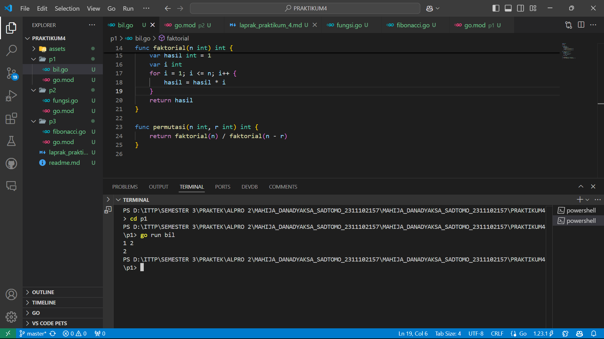
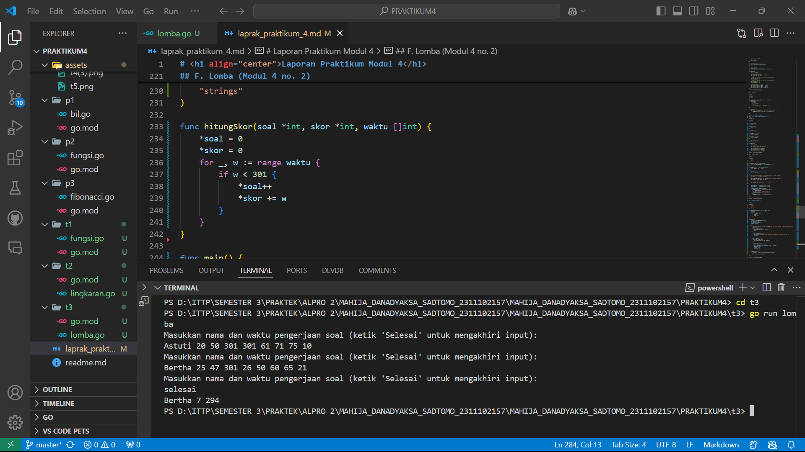

# <h1 align="center">Laporan Praktikum Modul 3 dan 4</h1>
<p align="center">Mahija Danadyaksa Sadtomo_2311102157</p>

## A. Bilangan Faktorial dan Permutasi

```go
package main
import (
	"fmt"
)
func main () {
	var a, b int
	fmt.Scan(&a, &b)
	if a >= b {
		fmt.Println(permutasi(a, b))
	} else {
		fmt.Println(permutasi(b, a))
	}
}
func faktorial(n int) int {
	var hasil int = 1
	var i int
	for i = 1; i <= n; i++ {
		hasil = hasil * i
	}
	return hasil
}

func permutasi(n int, r int) int {
	return faktorial(n) / faktorial(n - r)
}

```


## B. Bilangan Faktorial, Permutasi, dan Kombinasi

```go
package main

import (
	"fmt"
)

// fungsi faktorial
func faktorial(n int) int {
	if n == 0 || n == 1 {
		return 1
	}
	result := 1
	for i := 2; i <= n; i++ {
		result *= i
	}
	return result
}

// fungsi permutasi
func permutasi(n int, r int) int {
	return faktorial(n) / faktorial(n-r)
}

// fungsi kombinasi
func kombinasi(n int, r int) int {
	return faktorial(n) / (faktorial(r) * faktorial(n-r))
}

func main() {
	var a, b, c, d int
	
	// meminta memasukkan input dari user
	fmt.Println("Masukkan nilai a, b, c, d: ")
	fmt.Scan(&a, &b, &c, &d)

	// menghitung permutasi dan kombinasi untuk a terhadap b
	p1 := permutasi(a, c)
	c1 := kombinasi(a, c)
	
	// menghitung permutasi dan kombinasi untuk c terhadap d
	p2 := permutasi(b, d)
	c2 := kombinasi(b, d)

	// output hasil
	fmt.Printf("P(%d, %d) = %d\n", a, c, p1)
	fmt.Printf("C(%d, %d) = %d\n", a, c, c1)
	fmt.Printf("P(%d, %d) = %d\n", b, d, p2)
	fmt.Printf("C(%d, %d) = %d\n", b, d, c2)
}
```


## C. Fibonacci

```go
package main

import (
	"fmt"
)

// fungsi rekursif untuk menghitung deret fibonacci
func fibonacci(n int) int {
	if n == 0 {
		return 0
	} else if n == 1 {
		return 1
	} else {
		return fibonacci(n-1) + fibonacci(n-2)
	}
}

func main() {
	fmt.Println("mengembalikkan deret fibonacci hingga suku ke-10: ")
	for i := 0; i < 10; i++ {
		fmt.Printf("Fibonacci(%d) = %d\n", i, fibonacci(i))
	}
}
```


## D. Fungsi FoGoH, GoFoH, HoFoG (Modul 3 no. 2)
```go
package main

import (
	"fmt"
)

func f(x int) int {
	return x * x
}

func g(x int) int {
	return x - 2
}

func h(x int) int {
	return x + 1
}

func fogoh(a int) int {
	return f(g(h(a)))
}

func gohof(b int) int {
	return g(h(f(b)))
}

func hofog(c int) int {
	return h(f(g(c)))
}

func main() {
	var a, b, c int

	fmt.Println("Masukkan nilai a, b, dan c:")
	fmt.Scanf("%d %d %d", &a, &b, &c)

	fmt.Println("fogoh(a):", fogoh(a))
	fmt.Println("gohof(b):", gohof(b))
	fmt.Println("hofog(c):", hofog(c))
}
```


## E. Lingkaran (Modul 3 no. 3)

```go
package main

import (
	"fmt"
	"math"
)


func jarak(a, b, c, d float64) float64 {
	return math.Sqrt(math.Pow(a-c, 2) + math.Pow(b-d, 2))
}


func diDalam(cx, cy, r, x, y float64) bool {
	return jarak(cx, cy, x, y) <= r
}

func main() {
	var cx1, cy1, r1, cx2, cy2, r2 float64 
	var x, y float64                     

)
	fmt.Println("Masukkan pusat (cx1, cy1) dan radius (r1) untuk lingkaran 1:")
	fmt.Scanf("%f %f %f", &cx1, &cy1, &r1)


	fmt.Println("Masukkan pusat (cx2, cy2) dan radius (r2) untuk lingkaran 2:")
	fmt.Scanf("%f %f %f", &cx2, &cy2, &r2)


	fmt.Println("Masukkan koordinat titik sembarang (x, y):")
	fmt.Scanf("%f %f", &x, &y)


	dalamLingkaran1 := diDalam(cx1, cy1, r1, x, y)
	dalamLingkaran2 := diDalam(cx2, cy2, r2, x, y)


	if dalamLingkaran1 && dalamLingkaran2 {
		fmt.Println("Titik di dalam lingkaran 1 dan 2")
	} else if dalamLingkaran1 {
		fmt.Println("Titik di dalam lingkaran 1")
	} else if dalamLingkaran2 {
		fmt.Println("Titik di dalam lingkaran 2")
	} else {
		fmt.Println("Titik di luar lingkaran 1 dan 2")
	}
}

```


## F. Lomba (Modul 4 no. 2)

```go
package main

import (
	"bufio"
	"fmt"
	"os"
	"strings"
)

func hitungSkor(soal *int, skor *int, waktu []int) {
	*soal = 0
	*skor = 0
	for _, w := range waktu {
		if w < 301 {
			*soal++
			*skor += w
		}
	}
}

func main() {
	scanner := bufio.NewScanner(os.Stdin)
	var pemenang string
	var maxSoal, minWaktu int
	maxSoal = 0
	minWaktu = 999999

	for {
		fmt.Println("Masukkan nama dan waktu pengerjaan soal (ketik 'Selesai' untuk mengakhiri input):")
		scanner.Scan()
		input := scanner.Text()

		if strings.ToLower(input) == "selesai" {
			break
		}

		data := strings.Fields(input)
		if len(data) != 9 {
			fmt.Println("Input tidak valid, masukkan nama dan 8 nilai waktu pengerjaan soal.")
			continue
		}

		nama := data[0]
		waktu := make([]int, 8)
		for i := 0; i < 8; i++ {
			fmt.Sscanf(data[i+1], "%d", &waktu[i])
		}

		var soal, skor int
		hitungSkor(&soal, &skor, waktu)

		if soal > maxSoal || (soal == maxSoal && skor < minWaktu) {
			pemenang = nama
			maxSoal = soal
			minWaktu = skor
		}
	}

	if pemenang != "" {
		fmt.Printf("%s %d %d\n", pemenang, maxSoal, minWaktu)
	} else {
		fmt.Println("Tidak ada peserta.")
	}
}
```
