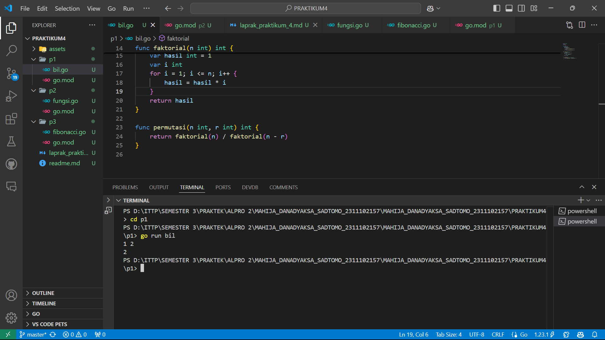
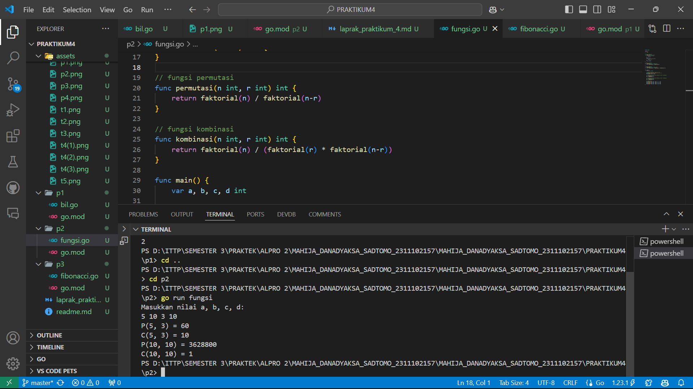
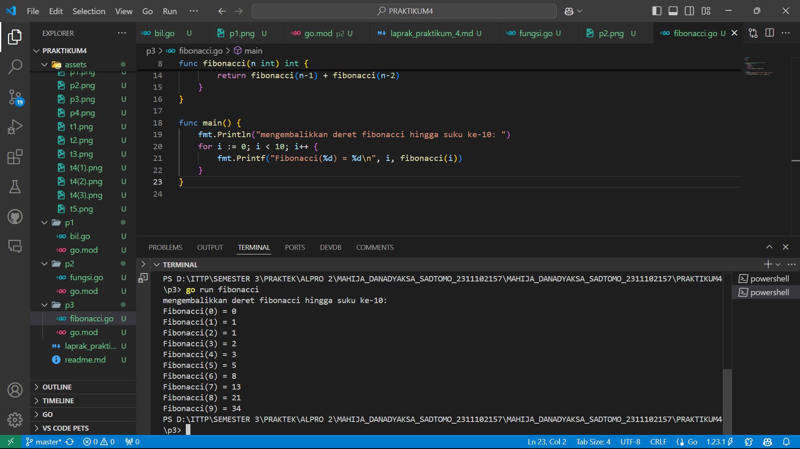

# <h1 align="center">Laporan Praktikum Modul 3</h1>
<p align="center">Mahija Danadyaksa Sadtomo_2311102157</p>

## A. Bilangan Faktorial dan Permutasi

```go
package main
import (
	"fmt"
)
func main () {
	var a, b int
	fmt.Scan(&a, &b)
	if a >= b {
		fmt.Println(permutasi(a, b))
	} else {
		fmt.Println(permutasi(b, a))
	}
}
func faktorial(n int) int {
	var hasil int = 1
	var i int
	for i = 1; i <= n; i++ {
		hasil = hasil * i
	}
	return hasil
}

func permutasi(n int, r int) int {
	return faktorial(n) / faktorial(n - r)
}

```


## B. Bilangan Faktorial, Permutasi, dan Kombinasi

```go
package main

import (
	"fmt"
)

// fungsi faktorial
func faktorial(n int) int {
	if n == 0 || n == 1 {
		return 1
	}
	result := 1
	for i := 2; i <= n; i++ {
		result *= i
	}
	return result
}

// fungsi permutasi
func permutasi(n int, r int) int {
	return faktorial(n) / faktorial(n-r)
}

// fungsi kombinasi
func kombinasi(n int, r int) int {
	return faktorial(n) / (faktorial(r) * faktorial(n-r))
}

func main() {
	var a, b, c, d int
	
	// meminta memasukkan input dari user
	fmt.Println("Masukkan nilai a, b, c, d: ")
	fmt.Scan(&a, &b, &c, &d)

	// menghitung permutasi dan kombinasi untuk a terhadap b
	p1 := permutasi(a, c)
	c1 := kombinasi(a, c)
	
	// menghitung permutasi dan kombinasi untuk c terhadap d
	p2 := permutasi(b, d)
	c2 := kombinasi(b, d)

	// output hasil
	fmt.Printf("P(%d, %d) = %d\n", a, c, p1)
	fmt.Printf("C(%d, %d) = %d\n", a, c, c1)
	fmt.Printf("P(%d, %d) = %d\n", b, d, p2)
	fmt.Printf("C(%d, %d) = %d\n", b, d, c2)
}
```



## C. Fibonacci

```go
package main

import (
	"fmt"
)

// fungsi rekursif untuk menghitung deret fibonacci
func fibonacci(n int) int {
	if n == 0 {
		return 0
	} else if n == 1 {
		return 1
	} else {
		return fibonacci(n-1) + fibonacci(n-2)
	}
}

func main() {
	fmt.Println("mengembalikkan deret fibonacci hingga suku ke-10: ")
	for i := 0; i < 10; i++ {
		fmt.Printf("Fibonacci(%d) = %d\n", i, fibonacci(i))
	}
}
```
