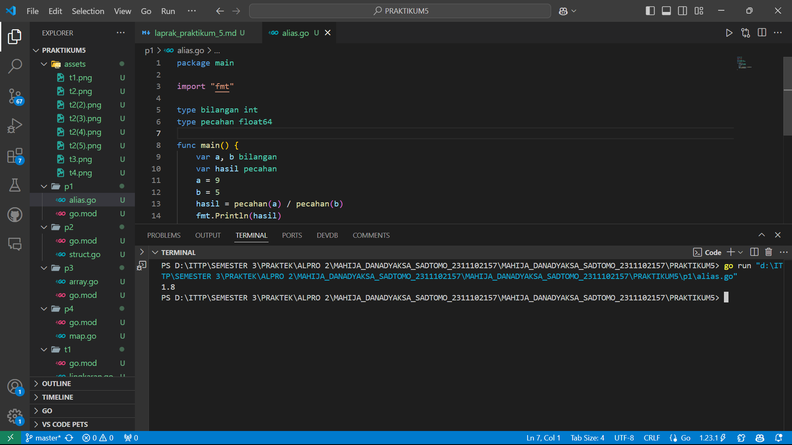
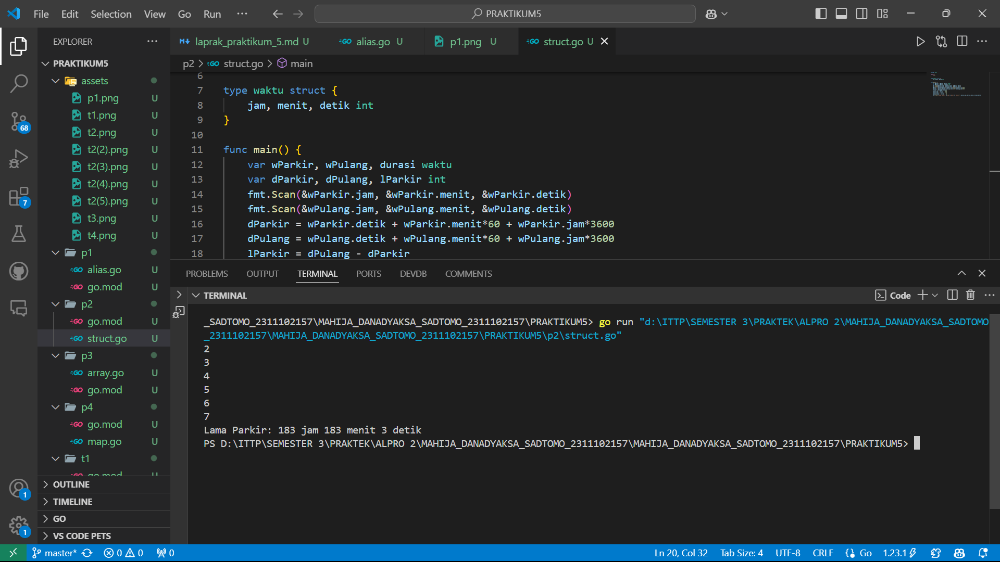
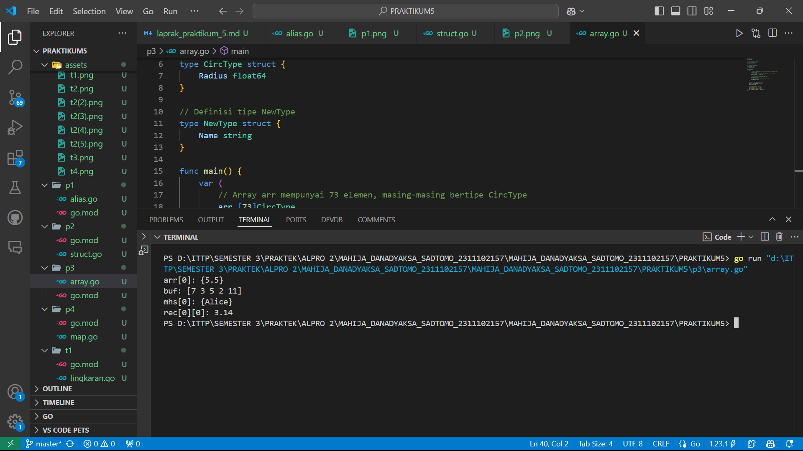
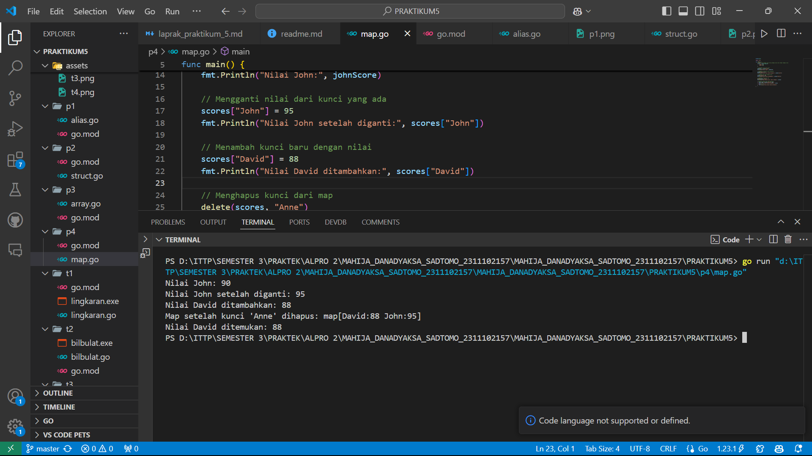
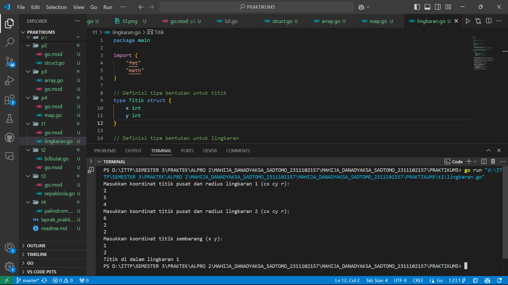
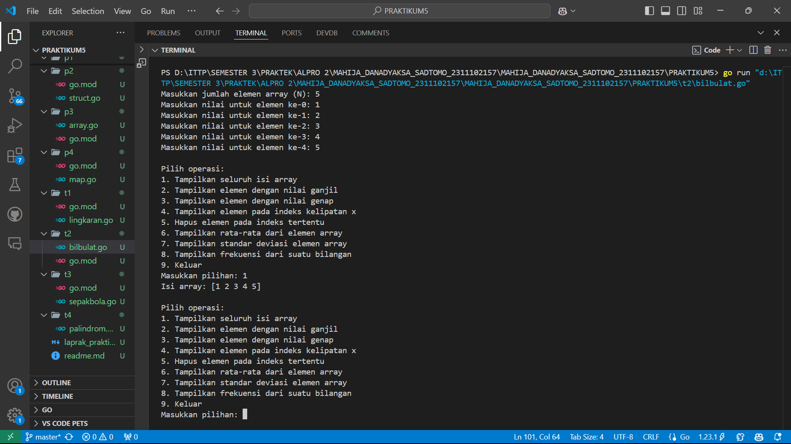
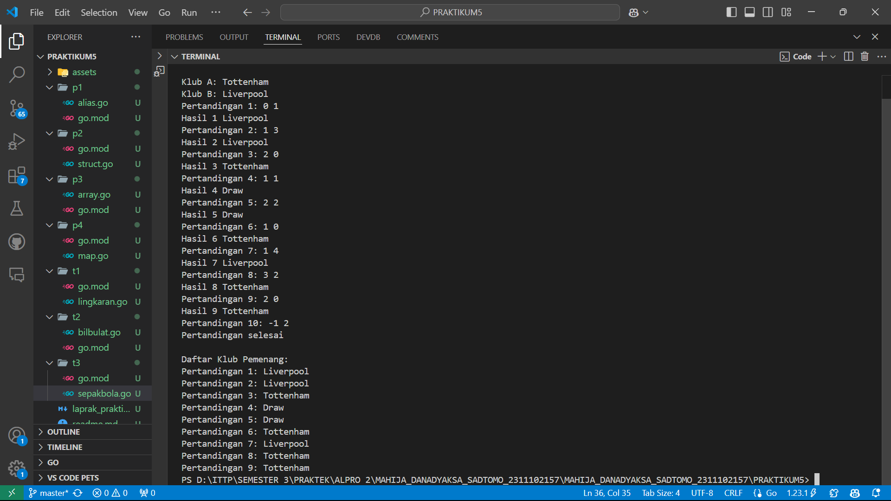
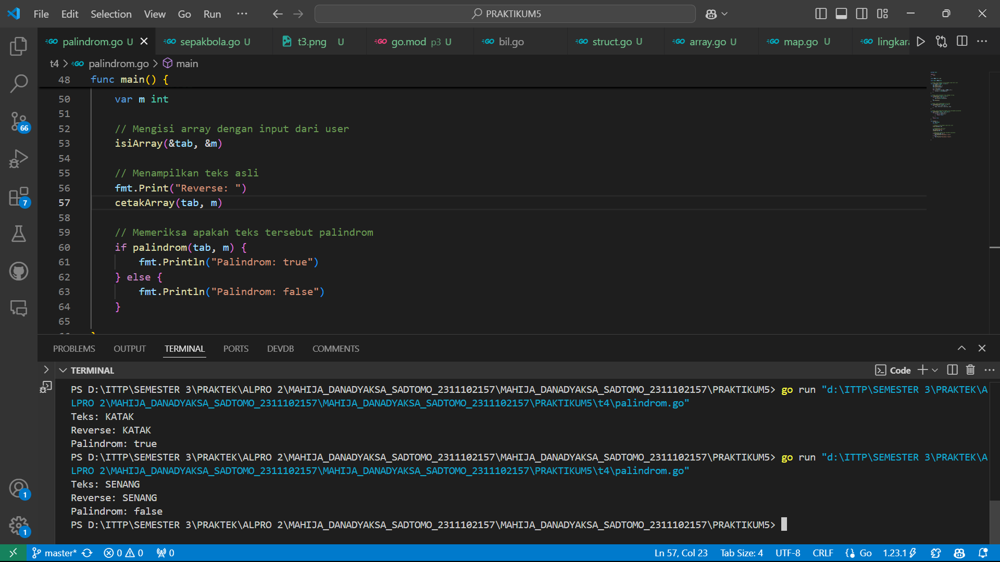

# <h1 align="center">Laporan Praktikum Modul 3 dan 4</h1>
<p align="center">Mahija Danadyaksa Sadtomo_2311102157</p>

## A. Alias

```go
package main

import "fmt"

type bilangan int
type pecahan float64

func main() {
	var a, b bilangan
	var hasil pecahan
	a = 9
	b = 5
	hasil = pecahan(a) / pecahan(b)
	fmt.Println(hasil)

}

```


## B. Struct

```go
package main

import (
	"fmt"
)

type waktu struct {
	jam, menit, detik int
}

func main() {
	var wParkir, wPulang, durasi waktu
	var dParkir, dPulang, lParkir int
	fmt.Scan(&wParkir.jam, &wParkir.menit, &wParkir.detik)
	fmt.Scan(&wPulang.jam, &wPulang.menit, &wPulang.detik)
	dParkir = wParkir.detik + wParkir.menit*60 + wParkir.jam*3600
	dPulang = wPulang.detik + wPulang.menit*60 + wPulang.jam*3600
	lParkir = dPulang - dParkir
	durasi.jam = lParkir / 3600
	durasi.jam = lParkir % 3600
	durasi.menit = lParkir / 60
	durasi.detik = lParkir % 60
	fmt.Printf("Lama Parkir: %d jam %d menit %d detik\n", durasi.jam, durasi.menit, durasi.detik)
}
```



## C. Array

```go
package main

import "fmt"

// Definisi tipe CircType
type CircType struct {
	Radius float64
}

// Definisi tipe NewType
type NewType struct {
	Name string
}

func main() {
	var (
		// Array arr mempunyai 73 elemen, masing-masing bertipe CircType
		arr [73]CircType

		// Array buf dengan 5 elemen, dengan nilai awal 7,3,5,2,11
		buf = [5]byte{7, 3, 5, 2, 11}

		// Array mhs berisi 2000 elemen NewType
		mhs [2000]NewType

		// Array dua dimensi rec berisi nilai float64
		rec [20][40]float64
	)

	// Mengisi beberapa elemen contoh
	arr[0] = CircType{Radius: 5.5}
	mhs[0] = NewType{Name: "Alice"}
	rec[0][0] = 3.14

	// Contoh penggunaan variabel
	fmt.Println("arr[0]:", arr[0])
	fmt.Println("buf:", buf)
	fmt.Println("mhs[0]:", mhs[0])
	fmt.Println("rec[0][0]:", rec[0][0])
}
```


## E. Map

```go
package main

import "fmt"

func main() {
	// Membuat map dengan tipe string sebagai kunci dan integer sebagai nilai
	scores := map[string]int{
		"John": 90,
		"Anne": 85,
	}

	// Mengambil nilai dari kunci
	johnScore := scores["John"]
	fmt.Println("Nilai John:", johnScore)

	// Mengganti nilai dari kunci yang ada
	scores["John"] = 95
	fmt.Println("Nilai John setelah diganti:", scores["John"])

	// Menambah kunci baru dengan nilai
	scores["David"] = 88
	fmt.Println("Nilai David ditambahkan:", scores["David"])

	// Menghapus kunci dari map
	delete(scores, "Anne")
	fmt.Println("Map setelah kunci 'Anne' dihapus:", scores)

	// Mengecek apakah kunci ada dalam map
	if score, ada := scores["David"]; ada {
		fmt.Println("Nilai David ditemukan:", score)
	} else {
		fmt.Println("Nilai David tidak ditemukan")
	}
}
```


## F. Titik Lingkaran (Modul 7 no. 1)

```go
package main

import (
	"fmt"
	"math"
)

// Definisi tipe bentukan untuk titik
type Titik struct {
	x int
	y int
}

// Definisi tipe bentukan untuk lingkaran
type Lingkaran struct {
	center Titik
	radius int
}

// Fungsi untuk menghitung jarak antara dua titik
func jarak(p Titik, q Titik) float64 {
	return math.Sqrt(float64((p.x-q.x)*(p.x-q.x) + (p.y-q.y)*(p.y-q.y)))
}

// Fungsi untuk menentukan apakah titik berada di dalam lingkaran
func didalam(c Lingkaran, p Titik) bool {
	return jarak(p, c.center) < float64(c.radius)
}

func main() {
	var (
		// Mengambil input untuk lingkaran 1
		lingkaran1 Lingkaran
		// Mengambil input untuk lingkaran 2
		lingkaran2 Lingkaran
		// Mengambil input untuk titik sembarang
		point Titik
	)

	// Input untuk lingkaran 1 (cx, cy, r)
	fmt.Println("Masukkan koordinat titik pusat dan radius lingkaran 1 (cx cy r):")
	fmt.Scan(&lingkaran1.center.x, &lingkaran1.center.y, &lingkaran1.radius)

	// Input untuk lingkaran 2 (cx, cy, r)
	fmt.Println("Masukkan koordinat titik pusat dan radius lingkaran 2 (cx cy r):")
	fmt.Scan(&lingkaran2.center.x, &lingkaran2.center.y, &lingkaran2.radius)

	// Input untuk titik sembarang (x, y)
	fmt.Println("Masukkan koordinat titik sembarang (x y):")
	fmt.Scan(&point.x, &point.y)

	// Mengecek posisi titik terhadap kedua lingkaran
	inLingkaran1 := didalam(lingkaran1, point)
	inLingkaran2 := didalam(lingkaran2, point)

	if inLingkaran1 && inLingkaran2 {
		fmt.Println("Titik di dalam lingkaran 1 dan 2")
	} else if inLingkaran1 {
		fmt.Println("Titik di dalam lingkaran 1")
	} else if inLingkaran2 {
		fmt.Println("Titik di dalam lingkaran 2")
	} else {
		fmt.Println("Titik di luar lingkaran 1 dan 2")
	}
}
```


## G. Menampilkan Array Berisi Bilangan Bulat

```go
package main

import (
	"fmt"
	"math"
)


func tampilArr(arr []int) {
	fmt.Println("Isi array:", arr)
}


func ganjil(arr []int) {
	fmt.Print("Elemen dengan nilai ganjil: ")
	for _, value := range arr {
		if value%2 != 0 {
			fmt.Print(value, " ")
		}
	}
	fmt.Println()
}


func genap(arr []int) {
	fmt.Print("Elemen dengan nilai genap: ")
	for _, value := range arr {
		if value%2 == 0 && value != 0 { 
			fmt.Print(value, " ")
		}
	}
	fmt.Println()
}


func kelipatan(arr []int, x int) {
	fmt.Printf("Elemen pada indeks kelipatan %d: ", x)
	for i := x - 1; i < len(arr); i += x {
		if arr[i] != 0 {
			fmt.Print(arr[i], " ")
		}
	}
	fmt.Println()
}


func hapus(arr []int, idx int) []int {
	return append(arr[:idx], arr[idx+1:]...)
}

func mean(arr []int) float64 {
	sum := 0
	for _, value := range arr {
		sum += value
	}
	return float64(sum) / float64(len(arr))
}


func deviasi(arr []int, rata float64) float64 {
	sumSquares := 0.0
	for _, value := range arr {
		sumSquares += math.Pow(float64(value)-rata, 2)
	}
	return math.Sqrt(sumSquares / float64(len(arr)))
}


func frekuensi(arr []int, target int) int {
	count := 0
	for _, value := range arr {
		if value == target {
			count++
		}
	}
	return count
}

func main() {
	var n, x, deleteIndex, target int


	fmt.Print("Masukkan jumlah elemen array (N): ")
	fmt.Scan(&n)

	
	array := make([]int, n)
	for i := 0; i < n; i++ {
		fmt.Printf("Masukkan nilai untuk elemen ke-%d: ", i)
		fmt.Scan(&array[i])
	}


	for {
		fmt.Println("\nPilih operasi:")
		fmt.Println("1. Tampilkan seluruh isi array")
		fmt.Println("2. Tampilkan elemen dengan nilai ganjil")
		fmt.Println("3. Tampilkan elemen dengan nilai genap")
		fmt.Println("4. Tampilkan elemen pada indeks kelipatan x")
		fmt.Println("5. Hapus elemen pada indeks tertentu")
		fmt.Println("6. Tampilkan rata-rata dari elemen array")
		fmt.Println("7. Tampilkan standar deviasi elemen array")
		fmt.Println("8. Tampilkan frekuensi dari suatu bilangan")
		fmt.Println("9. Keluar")

		var pilihan int
		fmt.Print("Masukkan pilihan: ")
		fmt.Scan(&pilihan)

		switch pilihan {
		case 1:
			tampilArr(array)

		case 2:
			ganjil(array)

		case 3:
			genap(array)

		case 4:
			fmt.Print("Masukkan nilai x untuk kelipatan indeks: ")
			fmt.Scan(&x)
			kelipatan(array, x)

		case 5:
			fmt.Print("Masukkan indeks untuk dihapus: ")
			fmt.Scan(&deleteIndex)
			if deleteIndex >= 0 && deleteIndex < len(array) {
				array = hapus(array, deleteIndex)
				tampilArr(array)
			} else {
				fmt.Println("Indeks tidak valid!")
			}

		case 6:
			rata := mean(array)
			fmt.Printf("Rata-rata elemen array: %.2f\n", rata)

		case 7:
			rata := mean(array)
			stdDev := deviasi(array, rata)
			fmt.Printf("Standar deviasi elemen array: %.2f\n", stdDev)

		case 8:
			fmt.Print("Masukkan nilai untuk mencari frekuensi: ")
			fmt.Scan(&target)
			frequency := frekuensi(array, target)
			fmt.Printf("Frekuensi %d dalam array: %d kali\n", target, frequency)

		case 9:
			fmt.Println("Keluar dari program.")
			return

		default:
			fmt.Println("Pilihan tidak valid!")
		}
	}
}
```

.png)
.png)
.png)
.png)

## H. Pertandingan Sepak Bola
```go
package main

import "fmt"

func main() {
	var A, B string
	var skorA, skorB int
	var pemenang []string
	pertandingan := 1

	
	fmt.Print("Klub A: ")
	fmt.Scanln(&A)
	fmt.Print("Klub B: ")
	fmt.Scanln(&B)


	for {
		fmt.Printf("Pertandingan %d: ", pertandingan)
		fmt.Scan(&skorA, &skorB)


		if skorA < 0 || skorB < 0 {
			fmt.Println("Pertandingan selesai")
			break
		}

	
		if skorA > skorB {
			pemenang = append(pemenang, A)
			fmt.Printf("Hasil %d %s\n", pertandingan, A)
		} else if skorB > skorA {
			pemenang = append(pemenang, B)
			fmt.Printf("Hasil %d %s\n", pertandingan, B)
		} else {
			pemenang = append(pemenang, "Draw")
			fmt.Printf("Hasil %d Draw\n", pertandingan)
		}

		pertandingan++
	}

	
	fmt.Println("\nDaftar Klub Pemenang:")
	for i, hasil := range pemenang {
		fmt.Printf("Pertandingan %d: %s\n", i+1, hasil)
	}
}
```


## I. Palindrom
```go
package main

import (
	"fmt"
)

const NMAX int = 127

type tabel [NMAX]rune

// Fungsi untuk mengisi array dengan input dari user
func isiArray(t *tabel, n *int) {
	var input string
	fmt.Print("Teks: ")
	fmt.Scanln(&input)

	*n = len(input)
	for i := 0; i < *n && i < NMAX; i++ {
		(*t)[i] = rune(input[i])
	}
}

// Fungsi untuk mencetak array sebagai string
func cetakArray(t tabel, n int) {
	for i := 0; i < n; i++ {
		fmt.Print(string(t[i]))
	}
	fmt.Println()
}

// Fungsi untuk membalikkan isi array
func balikanArray(t *tabel, n int) {
	for i := 0; i < n/2; i++ {
		t[i], t[n-i-1] = t[n-i-1], t[i]
	}
}

// Fungsi untuk memeriksa apakah array merupakan palindrom
func palindrom(t tabel, n int) bool {
	for i := 0; i < n/2; i++ {
		if t[i] != t[n-i-1] {
			return false
		}
	}
	return true
}

func main() {
	var tab tabel
	var m int

	// Mengisi array dengan input dari user
	isiArray(&tab, &m)

	// Menampilkan teks asli
	fmt.Print("Reverse: ")
	cetakArray(tab, m)

	// Memeriksa apakah teks tersebut palindrom
	if palindrom(tab, m) {
		fmt.Println("Palindrom: true")
	} else {
		fmt.Println("Palindrom: false")
	}

}

```
