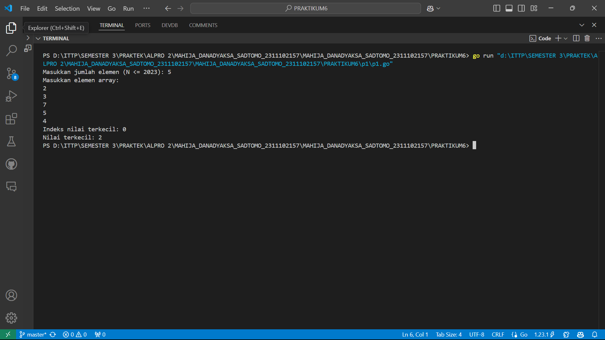
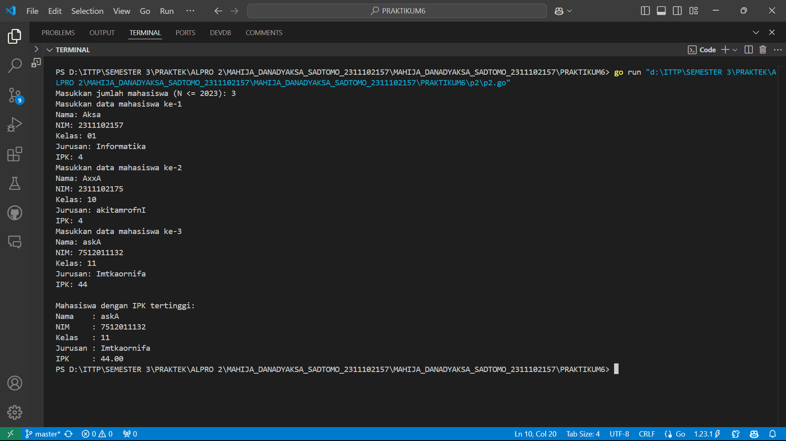
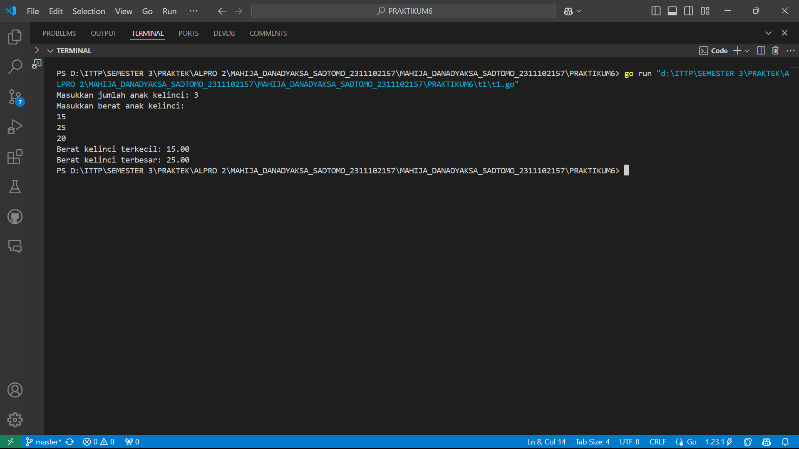

# <h1 align="center">Laporan Praktikum Modul 11</h1>
<p align="center">Mahija Danadyaksa Sadtomo_2311102157</p>

## A. Nilai Ekstrim bilangan

```go
package main

import (
	"fmt"
)

type arrInt [2023]int

// Fungsi untuk mencari indeks dari nilai terkecil
func terkecil_2(tabInt arrInt, n int) int {
	var idx int = 0 // indeks data pertama
	var j int = 1   // pencarian dimulai dari data kedua
	for j < n {
		if tabInt[idx] > tabInt[j] { // cek apakah tabInt[j] lebih kecil dari tabInt[idx]
			idx = j // update idx ke indeks baru yang nilainya lebih kecil
		}
		j = j + 1
	}
	return idx // mengembalikan indeks dari nilai terkecil
}

func main() {
	var n int
	var data arrInt

	// Input jumlah elemen N
	fmt.Print("Masukkan jumlah elemen (N <= 2023): ")
	fmt.Scan(&n)

	// Validasi N agar tidak melebihi kapasitas array
	if n <= 0 || n > 2023 {
		fmt.Println("Jumlah elemen harus antara 1 dan 2023")
		return
	}

	// Input elemen-elemen array
	fmt.Println("Masukkan elemen array:")
	for i := 0; i < n; i++ {
		fmt.Scan(&data[i])
	}

	// Panggil fungsi untuk mencari indeks nilai terkecil
	idxTerkecil := terkecil_2(data, n)
	fmt.Printf("Indeks nilai terkecil: %d\n", idxTerkecil)
	fmt.Printf("Nilai terkecil: %d\n", data[idxTerkecil])
}
```


## B. Nilai Ekstrim IPK Mahasiswa

```go
package main

import (
	"fmt"
)

// Mendefinisikan tipe data mahasiswa
type mahasiswa struct {
	nama, nim, kelas, jurusan string
	ipk                       float64
}

// Mendefinisikan array mahasiswa dengan kapasitas 2023
type arrMhs [2023]mahasiswa

// Fungsi untuk mencari indeks mahasiswa dengan IPK tertinggi
func IPK_2(T arrMhs, n int) int {
	// idx menyimpan indeks mahasiswa dengan IPK tertinggi sementara
	var idx int = 0
	var j int = 1
	for j < n {
		if T[idx].ipk < T[j].ipk {
			idx = j
		}
		j = j + 1
	}
	return idx
}

func main() {
	var n int
	var data arrMhs

	// Input jumlah mahasiswa
	fmt.Print("Masukkan jumlah mahasiswa (N <= 2023): ")
	fmt.Scan(&n)

	// Validasi jumlah mahasiswa
	if n <= 0 || n > 2023 {
		fmt.Println("Jumlah mahasiswa harus antara 1 dan 2023")
		return
	}

	// Input data mahasiswa
	for i := 0; i < n; i++ {
		fmt.Printf("Masukkan data mahasiswa ke-%d\n", i+1)
		fmt.Print("Nama: ")
		fmt.Scan(&data[i].nama)
		fmt.Print("NIM: ")
		fmt.Scan(&data[i].nim)
		fmt.Print("Kelas: ")
		fmt.Scan(&data[i].kelas)
		fmt.Print("Jurusan: ")
		fmt.Scan(&data[i].jurusan)
		fmt.Print("IPK: ")
		fmt.Scan(&data[i].ipk)
	}

	// Panggil fungsi untuk mencari indeks mahasiswa dengan IPK tertinggi
	idxTertinggi := IPK_2(data, n)

	// Tampilkan data mahasiswa dengan IPK tertinggi
	fmt.Println("\nMahasiswa dengan IPK tertinggi:")
	fmt.Printf("Nama    : %s\n", data[idxTertinggi].nama)
	fmt.Printf("NIM     : %s\n", data[idxTertinggi].nim)
	fmt.Printf("Kelas   : %s\n", data[idxTertinggi].kelas)
	fmt.Printf("Jurusan : %s\n", data[idxTertinggi].jurusan)
	fmt.Printf("IPK     : %.2f\n", data[idxTertinggi].ipk)
}
```



## C. Nilai Ekstrim Bayi Kelinci

```go
package main

import (
	"fmt"
)

func main() {
	var N int
	fmt.Print("Masukkan jumlah anak kelinci: ")
	fmt.Scan(&N)

	if N <= 0 || N > 1000 {
		fmt.Println("Jumlah anak kelinci harus antara 1 dan 1000")
		return
	}

	weight := make([]float64, N)
	fmt.Println("Masukkan berat anak kelinci:")
	for i := 0; i < N; i++ {
		fmt.Scan(&weight[i])
	}

	minWeight, maxWweight := weight[0], weight[0]

	for _, w := range weight[1:] {
		if w < minWeight {
			minWeight = w
		}
		if w > maxWweight {
			maxWweight = w
		}
	}

	fmt.Printf("Berat kelinci terkecil: %.2f\n", minWeight)
	fmt.Printf("Berat kelinci terbesar: %.2f\n", maxWweight)
}
```


## D. Pembagian Ikan Ke Wadah

```go
package main

import (
	"fmt"
	"math"
)

// Fungsi untuk menghitung total berat setiap wadah dan rata-rata berat per wadah
func calculateContainerWeightsAndAverage(x, y int, weights []float64) ([]float64, float64) {
	// Hitung jumlah wadah
	numContainers := int(math.Ceil(float64(x) / float64(y)))
	containerWeights := make([]float64, numContainers)

	// Hitung total berat per wadah
	for i, weight := range weights {
		containerWeights[i/y] += weight
	}

	// Hitung rata-rata berat
	total := 0.0
	for _, weight := range containerWeights {
		total += weight
	}
	average := total / float64(numContainers)

	return containerWeights, average
}

func main() {
	var x, y int
	fmt.Print("Masukkan banyak ikan yang akan dijual: ")
	fmt.Scan(&x)
	fmt.Print("Masukkan banyak ikan yang akan dimasukkan ke dalam wadah: ")
	fmt.Scan(&y)

	// Validasi input
	if x <= 0 || y <= 0 || x > 1000 {
		fmt.Println("Jumlah ikan harus antara 1 dan 1000, dan kapasitas wadah harus lebih dari 0.")
		return
	}

	weights := make([]float64, x)
	fmt.Printf("Masukkan berat %d ikan (dipisahkan dengan spasi): ", x)
	for i := 0; i < x; i++ {
		if _, err := fmt.Scan(&weights[i]); err != nil || weights[i] < 0 {
			fmt.Println("Berat ikan tidak valid. Masukkan angka positif.")
			return
		}
	}

	// Panggil fungsi untuk menghitung total berat dan rata-rata
	containerWeights, totalAverage := calculateContainerWeightsAndAverage(x, y, weights)

	// Cetak hasil
	fmt.Println("\nTotal berat di setiap wadah:")
	for i, weight := range containerWeights {
		fmt.Printf("Wadah %d: %.2f\n", i+1, weight)
	}

	fmt.Printf("\nRata-rata berat per wadah: %.2f\n", totalAverage)
}

```


## E. Nilai Ekstim Balita

```go
package main

import (
	"fmt"
)

type arrBalita [100]float64

func hitungMinMax(arrBerat arrBalita, bMin, bMax *float64, n int) {
	// inisialisasi bMin dan bMax dengan nilai pertama array
	*bMin = arrBerat[0]
	*bMax = arrBerat[0]

	// perulangan untuk mencari nilai bMin dan bMax
	for i := 1; i < n; i++ { // Menggunakan batas n untuk iterasi
		if arrBerat[i] < *bMin {
			*bMin = arrBerat[i]
		}
		if arrBerat[i] > *bMax {
			*bMax = arrBerat[i]
		}
	}
}


func rerata(arrBerat arrBalita, n int) float64 {
	var total float64
	// menggunakan batas n untuk iterasi
	for i := 0; i < n; i++ {
		total += arrBerat[i]
	}
	return total / float64(n)
}

func main() {
	var arrBerat arrBalita
	var bMin, bMax float64
	var n int

	// input jumlah data
	fmt.Print("Masukkan banyak data berat balita: ")
	fmt.Scanln(&n)

	// validasi jumlah data
	if n <= 0 || n > len(arrBerat) {
		fmt.Println("Jumlah data tidak valid")
		return
	}

	// input data berat balita
	for i := 0; i < n; i++ {
		fmt.Printf("Masukkan berat balita ke-%d: ", i+1)
		fmt.Scanln(&arrBerat[i])
	}

	// hitung dan tampilkan nilai minimum, maksimum, dan rerata
	hitungMinMax(arrBerat, &bMin, &bMax, n)

	// tampilkan hasil
	fmt.Println("Berat balita minimum: ", bMin, "kg")
	fmt.Println("Berat balita maksimum: ", bMax, "kg")
	fmt.Println("Rerata berat balita: ", rerata(arrBerat, n), "kg")
}
```
