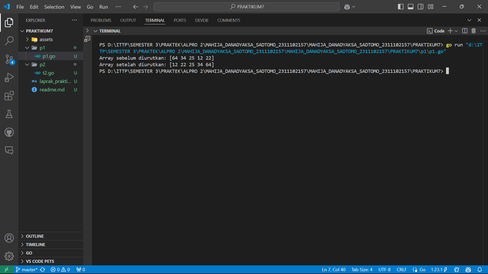
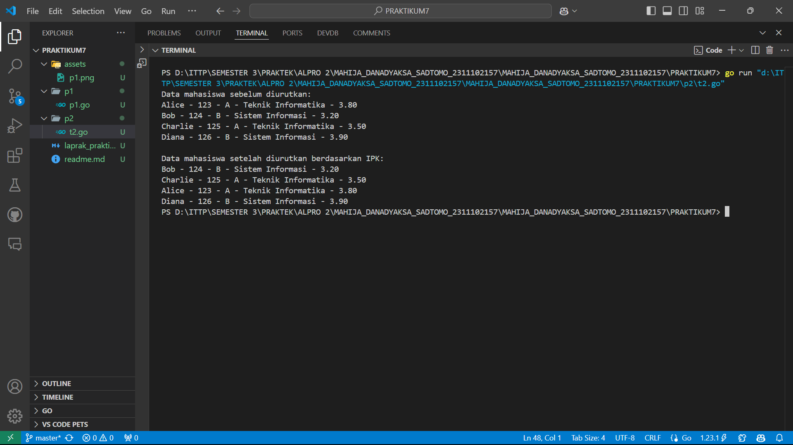
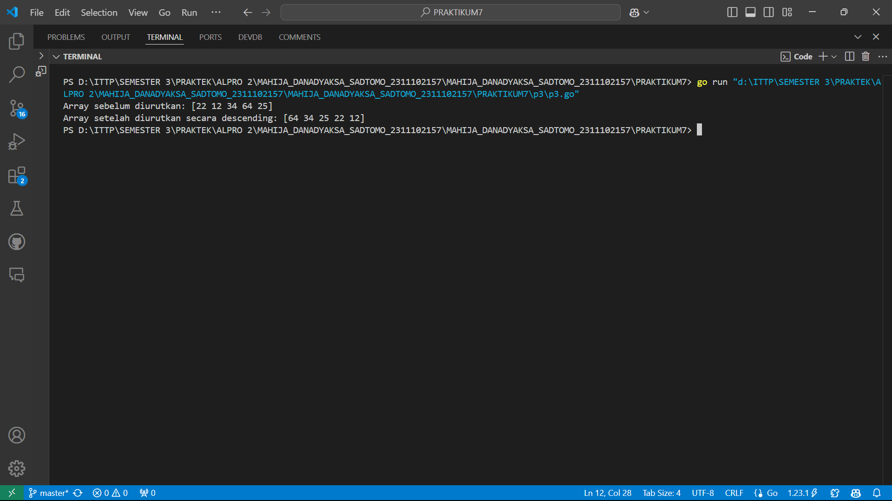
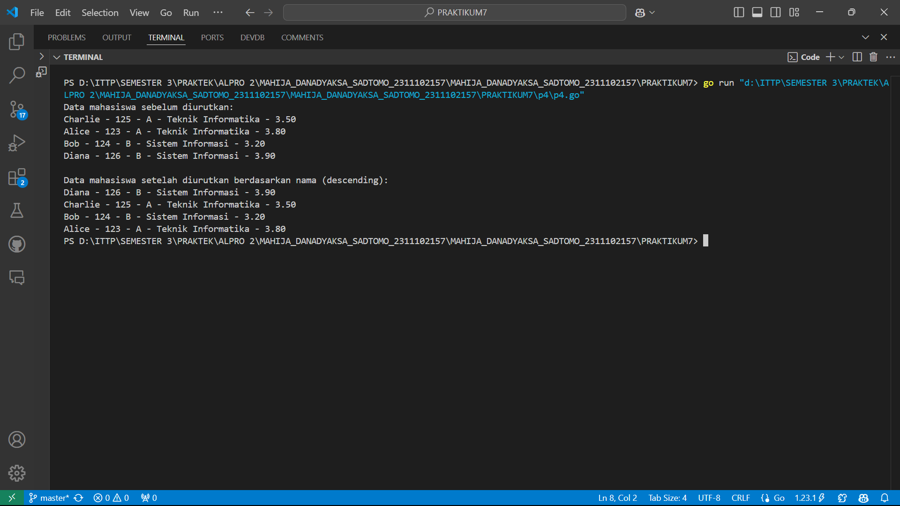
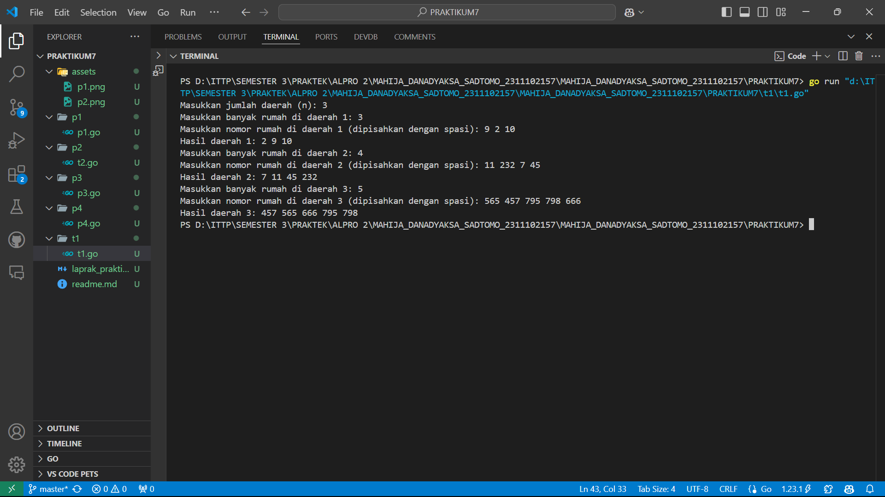
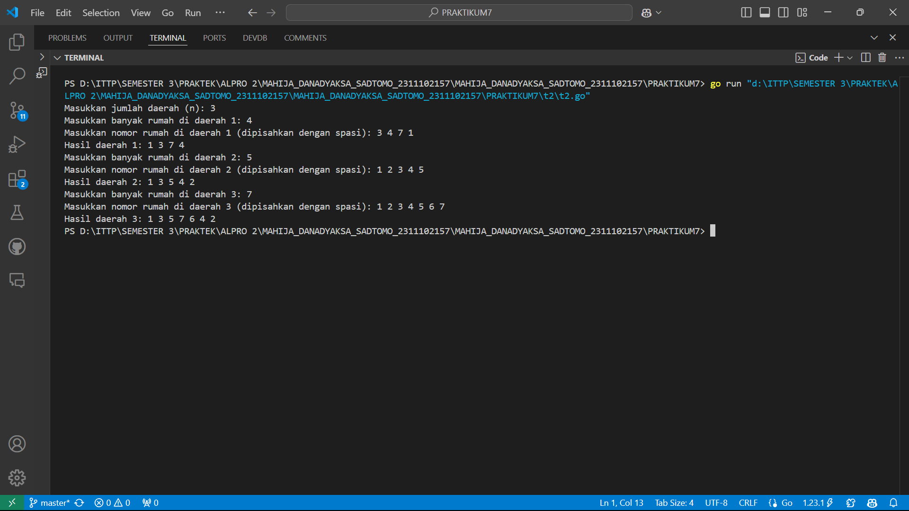
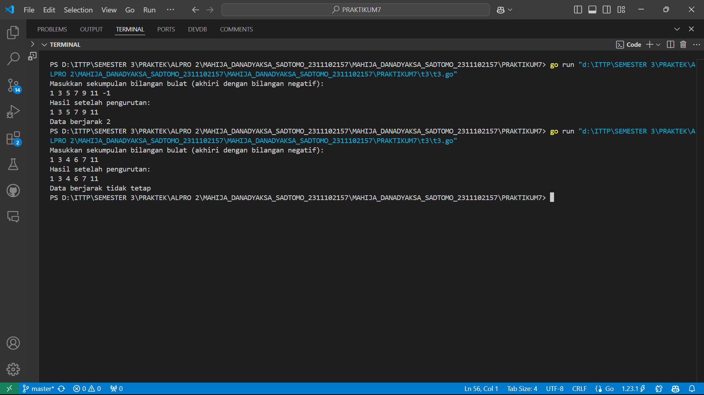
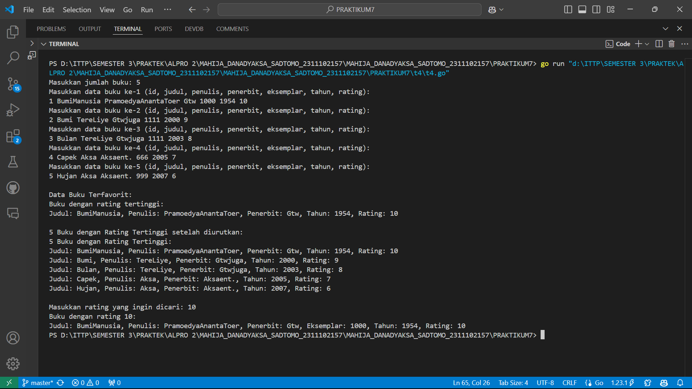

# <h1 align="center">Laporan Praktikum Modul 12</h1>
<p align="center">Mahija Danadyaksa Sadtomo_2311102157</p>

## A. Selection Sort

```go
package main

import "fmt"

type arrInt [4321]int

func selectionSort1(T *arrInt, n int) {
	/* I.S. terdefinisi array T yang berisi n bilangan bulat
	   F.S. array T terurut secara ascending atau membesar dengan SELECTION SORT */
	for i := 0; i < n-1; i++ {
		// Inisialisasi indeks minimum
		idx_min := i
		for j := i + 1; j < n; j++ {
			if T[j] < T[idx_min] {
				idx_min = j
			}
		}
		// Tukar elemen T[i] dengan T[idx_min] jika perlu
		if idx_min != i {
			T[i], T[idx_min] = T[idx_min], T[i]
		}
	}
}

func main() {
	// Contoh penggunaan
	var T arrInt
	n := 5
	T[0], T[1], T[2], T[3], T[4] = 64, 34, 25, 12, 22

	fmt.Println("Array sebelum diurutkan:", T[:n])
	selectionSort1(&T, n)
	fmt.Println("Array setelah diurutkan:", T[:n])
}

```


## B. Selection Sort Struct

```go
package main

import "fmt"

type mahasiswa struct {
	nama, nim, kelas, jurusan string
	ipk                       float64
}

type arrMhs [2023]mahasiswa

func selectionSort2(T *arrMhs, n int) {
	/* I.S. terdefinisi array T yang berisi n data mahasiswa
	   F.S. array T terurut secara ascending berdasarkan ipk dengan
	   menggunakan algoritma SELECTION SORT */

	var idx_min int
	var temp mahasiswa

	for i := 0; i < n-1; i++ {
		// Inisialisasi indeks minimum
		idx_min = i

		// Cari elemen dengan IPK terkecil di subarray [i+1, n-1]
		for j := i + 1; j < n; j++ {
			if T[j].ipk < T[idx_min].ipk {
				idx_min = j
			}
		}

		// Tukar elemen di indeks i dengan elemen di idx_min jika perlu
		if idx_min != i {
			temp = T[i]
			T[i] = T[idx_min]
			T[idx_min] = temp
		}
	}
}

func main() {
	// Contoh data mahasiswa
	var T arrMhs
	T[0] = mahasiswa{"Alice", "123", "A", "Teknik Informatika", 3.8}
	T[1] = mahasiswa{"Bob", "124", "B", "Sistem Informasi", 3.2}
	T[2] = mahasiswa{"Charlie", "125", "A", "Teknik Informatika", 3.5}
	T[3] = mahasiswa{"Diana", "126", "B", "Sistem Informasi", 3.9}
	n := 4

	fmt.Println("Data mahasiswa sebelum diurutkan:")
	for i := 0; i < n; i++ {
		fmt.Printf("%s - %s - %s - %s - %.2f\n", T[i].nama, T[i].nim, T[i].kelas, T[i].jurusan, T[i].ipk)
	}

	selectionSort2(&T, n)

	fmt.Println("\nData mahasiswa setelah diurutkan berdasarkan IPK:")
	for i := 0; i < n; i++ {
		fmt.Printf("%s - %s - %s - %s - %.2f\n", T[i].nama, T[i].nim, T[i].kelas, T[i].jurusan, T[i].ipk)
	}
}
```



## C. Insertion Sort

```go
package main

import "fmt"

type arrInt [4321]int

func insertionSort1(T *arrInt, n int) {
	/* I.S. terdefinisi array T yang berisi n bilangan bulat
	   F.S. array T terurut secara mengecil (descending) dengan INSERTION SORT */
	var temp, i, j int

	for i = 1; i < n; i++ {
		temp = T[i] // Simpan elemen ke-i
		j = i       // Inisialisasi indeks pembanding

		// Geser elemen-elemen sebelumnya yang lebih kecil dari temp
		for j > 0 && temp > T[j-1] {
			T[j] = T[j-1]
			j--
		}

		// Tempatkan temp pada posisi yang sesuai
		T[j] = temp
	}
}

func main() {
	// Contoh penggunaan
	var T arrInt
	n := 5
	T[0], T[1], T[2], T[3], T[4] = 22, 12, 34, 64, 25

	fmt.Println("Array sebelum diurutkan:", T[:n])
	insertionSort1(&T, n)
	fmt.Println("Array setelah diurutkan secara descending:", T[:n])
}
```


## D. Insertion Sort Struct

```go
package main

import "fmt"

type mahasiswa struct {
	nama, nim, kelas, jurusan string
	ipk                       float64
}

type arrMhs [2023]mahasiswa

func insertionSort2(T *arrMhs, n int) {
	/* I.S. terdefinisi array T yang berisi n data mahasiswa
	   F.S. array T terurut secara mengecil (descending) berdasarkan nama
	   dengan menggunakan algoritma INSERTION SORT */
	var temp mahasiswa
	var i, j int

	for i = 1; i < n; i++ {
		temp = T[i] // Simpan elemen ke-i
		j = i       // Inisialisasi indeks pembanding

		// Geser elemen-elemen sebelumnya
		for j > 0 && temp.nama > T[j-1].nama {
			T[j] = T[j-1]
			j--
		}

		// Tempatkan temp pada posisi yang sesuai
		T[j] = temp
	}
}

func main() {
	// Contoh data mahasiswa
	var T arrMhs
	T[0] = mahasiswa{"Charlie", "125", "A", "Teknik Informatika", 3.5}
	T[1] = mahasiswa{"Alice", "123", "A", "Teknik Informatika", 3.8}
	T[2] = mahasiswa{"Bob", "124", "B", "Sistem Informasi", 3.2}
	T[3] = mahasiswa{"Diana", "126", "B", "Sistem Informasi", 3.9}
	n := 4

	fmt.Println("Data mahasiswa sebelum diurutkan:")
	for i := 0; i < n; i++ {
		fmt.Printf("%s - %s - %s - %s - %.2f\n", T[i].nama, T[i].nim, T[i].kelas, T[i].jurusan, T[i].ipk)
	}

	insertionSort2(&T, n)

	fmt.Println("\nData mahasiswa setelah diurutkan berdasarkan nama (descending):")
	for i := 0; i < n; i++ {
		fmt.Printf("%s - %s - %s - %s - %.2f\n", T[i].nama, T[i].nim, T[i].kelas, T[i].jurusan, T[i].ipk)
	}
}
```


## E. Selection Sort Rumah Kerabat Hercules

```go
package main

import (
	"bufio"
	"fmt"
	"os"
	"strconv"
	"strings"
)

func rumahkerabat(arr []int) {
	n := len(arr)
	for i := 0; i < n-1; i++ {
		minIdx := i
		for j := i + 1; j < n; j++ {
			if arr[j] < arr[minIdx] {
				minIdx = j
			}
		}
		arr[i], arr[minIdx] = arr[minIdx], arr[i]
	}
}

func main() {
	reader := bufio.NewReader(os.Stdin)

	fmt.Print("Masukkan jumlah daerah (n): ")
	nInput, _ := reader.ReadString('\n')
	n, _ := strconv.Atoi(strings.TrimSpace(nInput))

	for i := 0; i < n; i++ {
		fmt.Printf("Masukkan banyak rumah di daerah %d: ", i+1)
		mInput, _ := reader.ReadString('\n')
		m, _ := strconv.Atoi(strings.TrimSpace(mInput))

		fmt.Printf("Masukkan nomor rumah di daerah %d (dipisahkan dengan spasi): ", i+1)
		housesInput, _ := reader.ReadString('\n')
		housesStr := strings.Fields(housesInput)

		houses := make([]int, m)
		for j := 0; j < m; j++ {
			houses[j], _ = strconv.Atoi(housesStr[j])
		}

		rumahkerabat(houses)

		fmt.Printf("Hasil daerah %d: ", i+1)
		for _, num := range houses {
			fmt.Printf("%d ", num)
		}
		fmt.Println()
	}
}

```


## F. Selection Sort Rumah Kerabat Dekat Kanan & Kiri Hercules

```go
package main

import (
	"bufio"
	"fmt"
	"os"
	"strconv"
	"strings"
)

func KerabatDekatGanjil(arr []int) {
	n := len(arr)
	for i := 0; i < n-1; i++ {
		minIdx := i
		for j := i + 1; j < n; j++ {
			if arr[j] < arr[minIdx] {
				minIdx = j
			}
		}
		arr[i], arr[minIdx] = arr[minIdx], arr[i]
	}
}

func KerabatDekatGenap(arr []int) {
	n := len(arr)
	for i := 0; i < n-1; i++ {
		maxIdx := i
		for j := i + 1; j < n; j++ {
			if arr[j] > arr[maxIdx] {
				maxIdx = j
			}
		}
		arr[i], arr[maxIdx] = arr[maxIdx], arr[i]
	}
}

func main() {
	reader := bufio.NewReader(os.Stdin)

	fmt.Print("Masukkan jumlah daerah (n): ")
	nInput, _ := reader.ReadString('\n')
	n, _ := strconv.Atoi(strings.TrimSpace(nInput))

	for i := 0; i < n; i++ {
		fmt.Printf("Masukkan banyak rumah di daerah %d: ", i+1)
		mInput, _ := reader.ReadString('\n')
		m, _ := strconv.Atoi(strings.TrimSpace(mInput))

		fmt.Printf("Masukkan nomor rumah di daerah %d (dipisahkan dengan spasi): ", i+1)
		housesInput, _ := reader.ReadString('\n')
		housesStr := strings.Fields(housesInput)

		houses := make([]int, m)
		for j := 0; j < m; j++ {
			houses[j], _ = strconv.Atoi(housesStr[j])
		}

		var oddHouses, evenHouses []int
		for _, house := range houses {
			if house%2 == 0 {
				evenHouses = append(evenHouses, house)
			} else {
				oddHouses = append(oddHouses, house)
			}
		}

		KerabatDekatGanjil(oddHouses)
		KerabatDekatGenap(evenHouses)

		fmt.Printf("Hasil daerah %d: ", i+1)
		for _, house := range oddHouses {
			fmt.Printf("%d ", house)
		}
		for _, house := range evenHouses {
			fmt.Printf("%d ", house)
		}
		fmt.Println()
	}
}
```


## G. Insertion Sort Jarak Antar Angka

```go
package main

import (
	"bufio"
	"fmt"
	"os"
	"strconv"
	"strings"
)

func insertionSort(arr []int) {
	for i := 1; i < len(arr); i++ {
		key := arr[i]
		j := i - 1
		for j >= 0 && arr[j] > key {
			arr[j+1] = arr[j]
			j--
		}
		arr[j+1] = key
	}
}

func penghitunganjarak(arr []int) string {
	if len(arr) < 2 {
		return "Data berjarak tidak tetap"
	}

	diff := arr[1] - arr[0]

	for i := 2; i < len(arr); i++ {
		if arr[i]-arr[i-1] != diff {
			return "Data berjarak tidak tetap"
		}
	}

	return fmt.Sprintf("Data berjarak %d", diff)
}

func main() {
	reader := bufio.NewReader(os.Stdin)

	fmt.Println("Masukkan sekumpulan bilangan bulat (akhiri dengan bilangan negatif):")
	input, _ := reader.ReadString('\n')
	input = strings.TrimSpace(input)

	inputs := strings.Fields(input)

	var numbers []int
	for _, val := range inputs {
		num, _ := strconv.Atoi(val)
		if num < 0 {
			break
		}
		numbers = append(numbers, num)
	}

	insertionSort(numbers)

	status := penghitunganjarak(numbers)

	fmt.Println("Hasil setelah pengurutan:")
	for _, num := range numbers {
		fmt.Printf("%d ", num)
	}
	fmt.Println()
	fmt.Println(status)
}

```


## H. Insertion Sort Buku 

```go
package main

import (
	"fmt"
)

const nMax = 7919

type Buku struct {
	id        int
	judul     string
	penulis   string
	penerbit  string
	eksemplar int
	tahun     int
	rating    int
}

type DaftarBuku []Buku

// Prosedur DaftarkanBuku
func tambahbuku(pustaka *DaftarBuku, n int) {
	for i := 0; i < n; i++ {
		var buku Buku
		fmt.Printf("Masukkan data buku ke-%d (id, judul, penulis, penerbit, eksemplar, tahun, rating):\n", i+1)
		fmt.Scan(&buku.id, &buku.judul, &buku.penulis, &buku.penerbit, &buku.eksemplar, &buku.tahun, &buku.rating)
		*pustaka = append(*pustaka, buku)
	}
}

// Prosedur CetakTerfavorit
func favoritBuku(pustaka DaftarBuku) {
	if len(pustaka) == 0 {
		fmt.Println("Tidak ada buku di pustaka.")
		return
	}
	maxRating := pustaka[0].rating
	for _, buku := range pustaka {
		if buku.rating > maxRating {
			maxRating = buku.rating
		}
	}
	fmt.Println("Buku dengan rating tertinggi:")
	for _, buku := range pustaka {
		if buku.rating == maxRating {
			fmt.Printf("Judul: %s, Penulis: %s, Penerbit: %s, Tahun: %d, Rating: %d\n", buku.judul, buku.penulis, buku.penerbit, buku.tahun, buku.rating)
		}
	}
}

// Prosedur UrutBuku (menggunakan insertion sort)
func UrutBuku(pustaka *DaftarBuku) {
	n := len(*pustaka)
	for i := 1; i < n; i++ {
		key := (*pustaka)[i]
		j := i - 1
		for j >= 0 && (*pustaka)[j].rating < key.rating {
			(*pustaka)[j+1] = (*pustaka)[j]
			j--
		}
		(*pustaka)[j+1] = key
	}
}

// Prosedur Cetak5Terbaru
func ratingTertinggiBuku(pustaka DaftarBuku) {
	fmt.Println("5 Buku dengan Rating Tertinggi:")
	for i := 0; i < 5 && i < len(pustaka); i++ {
		buku := pustaka[i]
		fmt.Printf("Judul: %s, Penulis: %s, Penerbit: %s, Tahun: %d, Rating: %d\n", buku.judul, buku.penulis, buku.penerbit, buku.tahun, buku.rating)
	}
}

// Prosedur CariBuku
func CariBuku(pustaka DaftarBuku, r int) {
	found := false
	fmt.Printf("Buku dengan rating %d:\n", r)
	for _, buku := range pustaka {
		if buku.rating == r {
			fmt.Printf("Judul: %s, Penulis: %s, Penerbit: %s, Eksemplar: %d, Tahun: %d, Rating: %d\n",
				buku.judul, buku.penulis, buku.penerbit, buku.eksemplar, buku.tahun, buku.rating)
			found = true
		}
	}
	if !found {
		fmt.Println("Tidak ada buku dengan rating tersebut.")
	}
}

func main() {
	var pustaka DaftarBuku
	var n, rating int

	fmt.Print("Masukkan jumlah buku: ")
	fmt.Scan(&n)

	tambahbuku(&pustaka, n)
	fmt.Println("\nData Buku Terfavorit:")
	favoritBuku(pustaka)

	UrutBuku(&pustaka)
	fmt.Println("\n5 Buku dengan Rating Tertinggi setelah diurutkan:")
	ratingTertinggiBuku(pustaka)

	fmt.Print("\nMasukkan rating yang ingin dicari: ")
	fmt.Scan(&rating)
	CariBuku(pustaka, rating)
}

```
